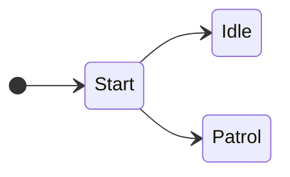

### UnityHFSM

1. hierarchical finite state machine - 分层状态机
2. [UnityHFSM](https://github.com/Inspiaaa/UnityHFSM)

##### 安装

1. 通过 [[OpenUPM]] 安装。

```cs
openupm-cn add com.inspiaaa.unityhfsm
```

##### 创建状态机

```cs
using FSM;
public class EnemyController : MonoBehaviour
{
    private void Start()
    {
        // 创建一个状态机
        StateMachine fsm = new StateMachine();
        // TStateDefine 为状态ID的类型，可以是枚举等
        StateMachine fsm = new StateMachine<TStateDefine>();
        // Add State
        // Add Transition
             
        // 设置默认状态
        fsm.SetStartState("FollowPlayer");
        // 初始化，必须在 OnLogic 之前调用
        fsm.Init();
    }
}
```

##### 更新状态机

```cs
private void Update()
{
    // 运行状态机
    fsm.OnLogic();
}
```

##### 状态查询

```cs
private void TestFunc()
{
    // 获取现态
    StateBase<string> state = fsm.ActiveState;
    string name = fsm.ActiveStateName;
}
```

### Add States

##### Normal States

```cs
// 添加空状态(什么都不做的状态)
fsm.AddState("Running");
fsm.AddState("Running", new StateBase<string>(needsExitTime: false));
fsm.AddState("ExtractIntel", new State());

fsm.AddState("FleeFromPlayer", new State(
    onLogic: (state) => MoveTowardsPlayer(-1)
));
        
fsm.AddState("FollowPlayer", new State(
    onLogic: (state) => 
    {
        MoveTowardsPlayer(1);
    }
));
```

##### CustomClass States

```cs
fsm.AddState("FollowPlayer", new CustomSendData(this));

// .....

class CustomSendData : StateBase
{
    MonoBehaviour mono;

    // Important: The constructor must call StateBase's constructor (here: base(...))
    // because it declares whether the state needsExitTime
    public CustomSendData(MonoBehaviour mono) : base(needsExitTime: false)
    {
        // We need to have access to the MonoBehaviour so that we can rotate it.
        // => Keep a reference
        this.mono = mono;
    }

    public override void OnEnter()
    {
        // Write your code for OnEnter here.
        // If you don't have any, you can just leave this entire method override out.
    }

    public override void OnLogic()
    {
        this.mono.transform.eulerAngles += new Vector3(0, 0, 100 * Time.deltaTime);
    }
}
```

##### Coroutine States

```cs
IEnumerator SendData(CoState<string, string> state)
{
    while (state.timer.Elapsed < 2)
    {
        RotateAtSpeed(100f);
        // Wait until the next frame
        yield return null;
    }

    while (state.timer.Elapsed < 4)
    {
        RotateAtSpeed(-100f);
        yield return null;
    }

    state.timer.Reset();
    // 如果 needsExitTime 设置为true, 必须通知 FSM 此状态可以安全退出
    state.fsm.StateCanExit();
}

void Start()
{
    // ...
    extractIntel.AddState("SendData", new CoState(
        this,   // Pass in the MonoBehaviour that should run the coroutine
        onLogic: SendData,
        needsExitTime: true
    ));
    // ...
}
```


##### Ghost States




1. Ghost状态可以帮助组织状态和管理转换条件。

```cs
fsm.AddState("Start", isGhostState: true);
fsm.AddState("Idle");
fsm.AddState("Patrol");

fsm.SetStartState("Start");

// If the distance to the player > 10, the fsm will transition to the Idle state.
fsm.AddTransition("Start", "Idle", t => distanceToPlayer > 10);
// Because the state machine reviews the transitions in the order they were added,
// it will first check the first transition.
// If the condition is false, the fsm will then try the second transition,
// which is guaranteed to work.
fsm.AddTransition("Start", "Patrol");
```

##### 自定义状态机 Action

1. 可以定义除了 `OnEnter`, `OnLogic`, `OnExit` 之外的任意状态机Action。
2. 调用自定义Action，只有当前激活的状态定义了此 Action，才会运行这个Action。
3. 每个状态每个Action类型至多只能定义一个。

```cs
fsm.AddState(
    "Running",
    new State()
        .AddAction("OnFixedUpdate", () => { })
        
        .AddAction<float>("OnHit", damage => PlayHitAnimation(damage))
        
        .AddAction<float, string>(
                "OnDamage",  
                ((float damage, string damageSource) data) => {
                        // ...
                };
        )
);

private void FixedUpdate()
{
    fsm.OnAction(OnFixedUpdate);
}
private void Test()
{
    fsm.OnAction<float>("OnHit", 5);
    fsm.OnAction<(float damage, string damageSource)>("OnDamage", (2, "Enemy"));
}
```


----


### Add Transitions

##### OnLogic Transitions - Direct

1. 添加状态切换条件，每次调用 OnLogic 都会按照添加先后自动检查是否符合条件。
2. polling-based 
3. **两个状态之间的转换条件可以有多个。**

```cs
// 添加无条件转换
fsm.AddTransition("Shoot", "Reload");
// 添加有条件切换
fsm.AddTransition(new Transition(
    "ExtractIntel", "FollowPlayer",
    (transition) => DistanceToPlayer() > ownScanningRange
));
fsm.AddTransition(new Transition(
    "FollowPlayer", "ExtractIntel",
    (transition) => DistanceToPlayer() < ownScanningRange
));
fsm.AddTransition(new Transition(
    "ExtractIntel", "FleeFromPlayer",
    (transition) => DistanceToPlayer() < playerScanningRange
));
fsm.AddTransition(new Transition(
    "FleeFromPlayer", "ExtractIntel",
    (transition) => DistanceToPlayer() > playerScanningRange
));

// 多条件转换
fsm.AddTransition(new TransitionAfter("MainMenu", "Game", 10));
fsm.AddTransition(new Transition("MainMenu", "Game", t => Input.GetKeyDown(KeyCode.Space)));
```


##### Trigger Transitions - Direct

1. event-based，只有在某个事件触发时才会检查是否满足。

```cs
// 定义
fsm.AddTriggerTransition("OnCollision", new Transition("Alive", "Dead", t => health < 0));
fsm.AddTriggerTransition("OnHit", "Alive", "Dead", t => health < 0);
// 触发, 触发事件会沿着状态机的层次向下不断传递
fsm.Trigger("OnCollision");
```

##### Any Transitions - Global

1. 相当于 Animator 的 Any State

```cs
fsm.AddTransitionFromAny( "Dead", t => (health <= 0));

fsm.AddTriggerTransitionFromAny("OnHit", "Dead", t => (health <= 0));
fsm.Trigger("OnHit");
```

##### TwoWay Transitions - Direct

```cs
// 条件为true时从A->B, 条件为false时从B->A
fsm.AddTwoWayTransition("Idle", "Shoot", t => isInRange);
// 满足条件之后2秒才切换状态
// 可以防止距离在10的附近不断变化时，状态不断切来切去
fsm.AddTwoWayTransition(
     new TransitionAfter("Idle", "Chase", 2, t => distanceToPlayer < 10)
);
// 添加双向触发状态切换条件
fsm.AddTwoWayTrigerTransition("OnCoinsChange", 
    "TooExpensive", "Affordable", t => coins > 100);
fsm.AddTwoWayTriggerTransition("OnCoinsChange",
    new Transition("TooExpensive","Affordable", t => coins > 100)
);
```

##### No Transitions - Direct

1. 如果当前状态 needsExitTime，则目标状态会变成 pending state。
2. 如果请求了多个转换，但当前的状态还不能退出，只有最后的转换会发生。

```cs
fsm.RequestStateChange("ExtractIntel");
fsm.RequestStateChange("ExtractIntel", forceInstantly: true);
```


##### 条件触发顺序


### 分层状态机


1. `State` 和 `StateMachine` 都继承自 `StateBase`，所以 `StateMachine` 也能被看作一个普通的状态。

```cs
private void Start()
{
    // This is the main state machine
    fsm = new StateMachine();
    // This is the nested state machine
    StateMachine extractIntel = new StateMachine(needsExitTime: false);
    fsm.AddState("ExtractIntel", extractIntel);

    extractIntel.AddState("SendData", new State(
        onLogic: (state) =>
        {
            // When the state has been active for more than 5 seconds,
            // notify the fsm that the state can cleanly exit
            if (state.timer.Elapsed > 5)
                state.fsm.StateCanExit();
            // Make the enemy turn at 100 degrees per second
            RotateAtSpeed(100f);
        },
        // This means the state won't instantly exit when a transition should happen
        // but instead the state machine waits until it is given permission to change state
        needsExitTime: true
    ));

    extractIntel.AddState("CollectData", new State(
        onLogic: (state) => {if (state.timer.Elapsed > 5) state.fsm.StateCanExit();},
        needsExitTime: true
    ));

    // A transition without a condition
    extractIntel.AddTransition(new Transition("SendData", "CollectData"));
    extractIntel.AddTransition(new Transition("CollectData", "SendData"));
    extractIntel.SetStartState("CollectData");


    // ...
}
```
