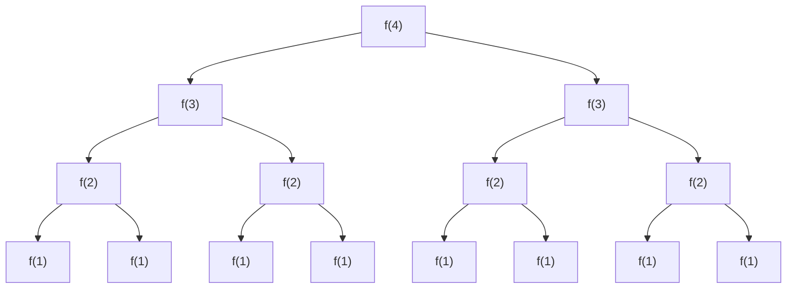

---

math: true
mermaid: true

---

## 算法的步数

1. 我们使用“步数”来描述运行时间。“1步”就是**计算的基本单位**。
2. 可以通过测试“计算从开始到结束总共执行了多少步”来求得算法的运行时间。

## 大 Ο 

1. 大O，即 **order of**，**大约**的意思。
2. 大Ο、大 θ (theta) 、大 Ω (omega) 分别描述了运行时间的上界、确界和下界。
    - 比如一个算法的时间复杂度的确界是  θ($N$)，那它的上界可以是 O($N^2$) , O($N^3$), 甚至 O($2^N$)，它的下界可以是 O(1)，和输入，问题规模是无关的。
3. 最优、最坏和期望情况是用来描述给定输入或场景中的大 Ο 时间（确界）。
    - 比如快排，最优 Ο($N$)， 最坏 Ο($N^2$)，期望 Ο($NlogN$)。
4. 工业界一般用大O指代确界。
5. 大 O 仅仅描述增长的趋势，常量不算在运行时间中，$O(2N) == O(N)$。
6.  大 Ο 更多地表现了运行时间的规模，$Ο(N)$ 并不总是比  $Ο(N^2)$ 快。
7. 不重要的项可以丢掉，比如：$Ο(N^2 + N)$ 变成 $Ο(N^2)$。类似高阶无穷小是无关紧要的。
8. $O(N^2) \ne O(N*M)$，如果 N 和 M 没有建立关系，则两个变量都要保留。

## 几个常见大 Ο 的增长速率

   1. $O(1) < O(logN) < O(N) < O(NlogN) < O(N^{2)}< O(N^3) < O(2^N) < O(N!) < O(N^N)$
   3. 

## 多项式算法：加与乘

1. 如果你的算法是“做这个，结束之后做那个”的形式，就是加 （两个独立的循环）
2. 如果你的算法是“对这个的每个元素做那个”的形式，就是乘 （嵌套循环）
   
    

## O(logN) 运行时间 

如果每次操作都能把**问题规模减半**，则很可能是 $log$ 时间

>比如二分查找，初始元素N个，每次搜索都会使问题规模减半。
>
>每次搜索后剩下的元素个数分别为：N，N / 2，……，8，4，2，1
>
>倒过来看：1，2，4，8，……，N / 2，N
>
>设搜索一共执行了 k 次，
>
>则 由 $2^k=N$（等比数列的通项公式） 
>
>得  $k = log_2N$


## 递归的运行时间

递归的题目，画出调用树，模拟代码的执行过程，使用树的公式计算时间复杂度，**不要数个数**！

一般情况下，运行时间往往是 $O({分支数}^{数的深度})$ 或者 $O(N)$ （单分支）

如果看到一个算法有多个递归调用，就可以认为它的运行时间是指数级的。

```c++
int f(int n) 
{
    if (n <= 1) {
        return 1;
    }
    return f(n-1) + f(n-1);
}
```





| 层   | 节点数 |
| ---- | ------ |
| 0    | $2^0$  |
| 1    | $2^1$  |
| 2    | $2^2$  |
| 3    | $2^3$  |
| 4    | $2^4$  |

节点总数为 $2^0 + 2^1+2^2+2^3+...+2^N = 2^{N+1}$

一般情况下，运行时间往往是 $O({分支数}^{数的深度})$ 


## 例题


### 1. 程序员面试金典 6.10.例3

```c++
void printUnorderedPairs(int[] array) 
{ 
    for (int i = 0; i < array.length; i++) 
    {
        for (int j = i + 1; j < array.length; j++) 
        { 
            System.out.println(array[i] + "," + array[j]); 
        } 
    } 
} 
```

分析：

- i 和 j 共有 $N^2$ 种组合，这种情况下时间复杂度是 $O(N^2)$
- 可以粗略地认为其中一半 i < j，另一半 i > j。
-  即 $O({1 \over 2} N^2) = O(N)$


### 2. 程序员面试金典 6.10.例9

把平衡二叉搜索树上所有节点的值相加

```c++
int sum(Node node) 
{ 
    if (node == null) 
    { 
        return 0; 
    } 
    return sum(node.left) + node.value + sum(node.right); 
} 
```

分析：

- **仅仅是二叉搜索树不意味着 $log$ 时间**
- *仅仅是递归算法也不意味着 $2^N$ 时间**
- 问题出在调用栈的深度上，上面递归的例子，递归深度是 $N$，这个问题递归深度是 $log^N$
-  即 $O(2^{logN}) = O(N)$


### 3. 程序员面试金典 6.10.例16

下面的函数递归地打印了从 1 到 n 中 2 的幂数。例如，如果 n 等于 4，它将打印 1、2、4。 它的运行时间是多少？

```c++
int powersOf2(int n) { 
    if (n < 1) { 
        return 0; 
    } else if (n == 1) { 
        System.out.println(1); 
        return 1; 
    } else { 
        int prev = powersOf2(n / 2); 
        int curr = prev * 2; 
        System.out.println(curr); 
        return curr; 
    } 
}
```

分析：

- 它打印 1 到 n 中所有 2 的幂数。
- 因此，函数被调用的次数（相当于它的运行时间）应当等于 1 到 n 中 2 的幂数的个数。
-  1 到 n 中有 $logN$ 个 2 的幂数，因此，运行时间是 $Ο(logN)$。
